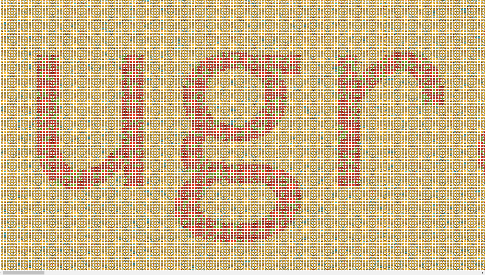

# Emoji: Reborn: Write-up

В приложенном файле ни много ни мало — 300 000 эмодзи! 150 строк по две тысячи эмодзи в каждой!

Что же с ними делать?

Можно попробовать как на [отборочном этапе](https://github.com/upmlctf/2018-quals/tree/master/emoji) запилить частотный анализ. Но авторы таска намекают, что тут речь о чём-то другом.

Если открыть эмодзи в текстовом редакторе, то, скорее всего, ничего хорошего из этого не выйдет — дело в том, что они не такие красивые, как в ваших любимых мессенджерах и соцсетях 😄. Хотя, как мы убедимся позже, это можно будет заметить и в текстовом редакторе.

Откроем текстовый файл... в браузере! Действительно, Chrome последней версии, показывает красивые эмодзи по умолчанию. Видим вверху разные желтые смайлы, а посередине начинаем замечать смайлы других цветов, причем как-то особенно расположенные.

Однако, нам мешает то, что вместо горизонтальной прокрутки браузер вежливо включил нам переносы строк.

Дальше можно идти разными способами, один из них — просто запихать это всё в тег `<pre>`. Я пошел [ещё дальше](private/solve.py) и сделал скрипт, который уменьшит размер шрифта.

Открываем и смотрим:

Флаг: **ugra_v3ry_3a5y_ta5k_and_th3_l0ng_flag**
