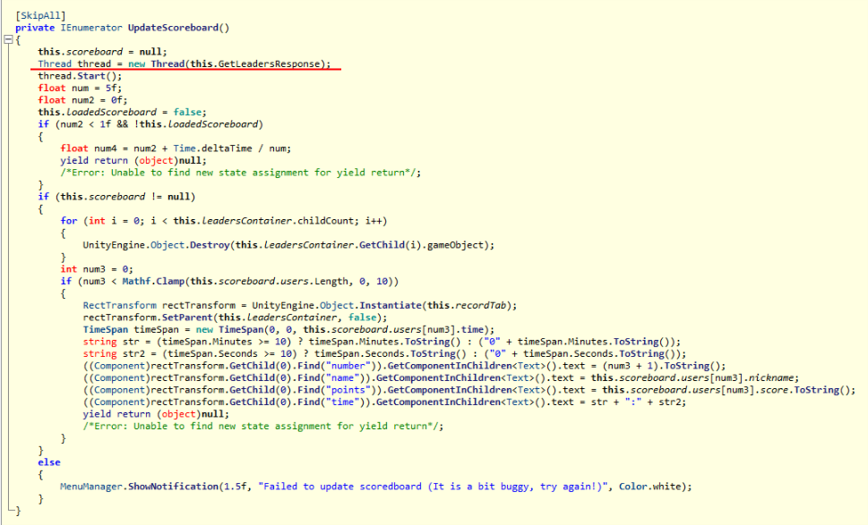

# Infinite Jumps III: Banned Hacker: Write-Up

Предыдущие части: 

* [Win the flag](../infinitejumps/WRITEUP.md)
* [Suspicious binaries](../jumpinside/WRITEUP.md)

----

Снова прыгаем в `Assembly-CSharp.dll`.

Нас интересует часть кода, ответственная за получение таблицы лидеров. Находим класс `OnlineManager`.

В нём видим функцию `TryUpdateScoreboard()`. Из неё вызывается другая _функция_ `UpdateScoreboard()` (это не функция, но всё же)


В этой функции запускается новый поток с функцией  `GetLeadersResponse()`



Посмотрим, что у неё под капотом:

```
...
TcpClient client = new TcpClient();
client.Connect("gameserver.ugractf.ru", 31337);
byte[] sendBytes = Encoding.UTF8.GetBytes(JsonUtility.ToJson(new RequestScoreboard()) + '\n');
```

Клиент открывает TCP-соединение с сервером `gameserver.ugractf.ru:31337` и посылает ему JSON-строку класса `RequestScoreboard`, который наследует класс `Request`:

```
class Request
{
    public string method;
}
class RequestScoreboard : Request
{
    public RequestScoreboard()
    {
        method = "users.scoreboard";
    }
}
```

Класс имеет всего лишь одну строку `method`, равную по умолчанию `"users.scoreboard"`. Таким образом, клиент лишь отправляет JSON-строку:

```
{"method": "users.scoreboard"}
```

У нас есть всё необходимое, чтобы выполнить запрос вручную, так как никаких защитных мер или идентификации нет.

```
echo '{"method": "users.scoreboard"}' | nc gameserver.ugractf.ru 31337
```

Ответ сервера:

```
{"status": "ok", "users": [{"nickname": "VERTEX", "score": 830, "time": 280},
...
{"nickname": "ugra_flag3_tr4shy_f3tch_ta5k", "score": -1337, "time": 666}]}
```

Другим способом получения флага был сниффинг трафика игры (например, `tcpdump`'ом) и доставание запроса скорборда оттуда.

Флаг: **ugra_flag3_tr4shy_f3tch_ta5k**

----

Следующие части: 

* [Hidden Resistance](../upgradejumps/WRITEUP.md)

P.S. Понравилась игра?
Пиши сюда: pirotexnic27@yandex.ru
