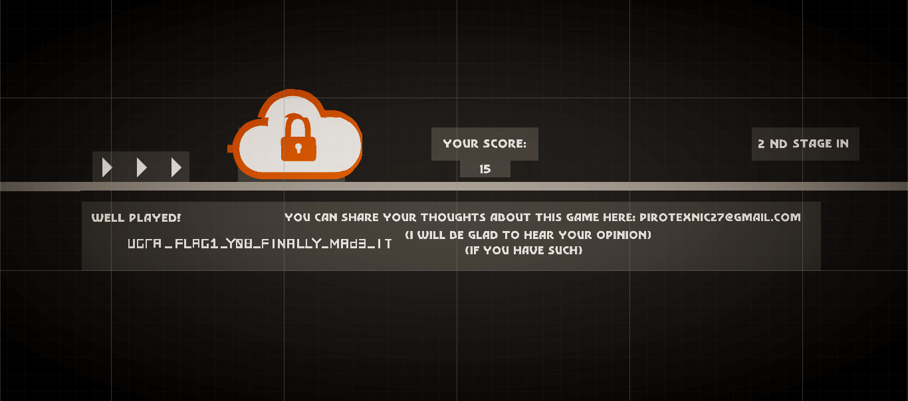
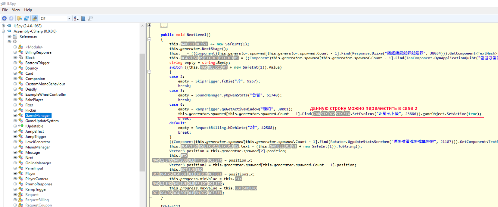

# Infinite Jumps I: Win the flag: Write-up

Для того, чтобы получить флаг, необходимо пройти целых пять уровней в скачанной игре (так это задумывалось разработчиком игры).

Этот флаг было невозможно достать из исходников. 

Однако, несложно понять, что игра сделана на Unity и написана на C#. Можно было попытаться пересобрать игру. Весь основной геймплей реализован в файле `Assembly-CSharp.dll` (он лежит в директории `infinite_jumps_Data/Managed`). Сделаем так, чтобы флаг вылетал на первом уровне:

Декомпилировать C# можно как через ilSpy, так и через dnSpy, однако последний позволяет легче пересобрать игру.

Также стоит заметить, что декомпиляция `infinite_jumps.exe` ни к чему не приведет, потому что код лежит именно в библиотеке.

Флаг: **ugra_flag1_y08_finally_mad3_it**  

----

Следующие части:

* [Suspicious Binaries](../jumpinside/WRITEUP.md)
* [Banned Hacker](../hackedjumps/WRITEUP.md)
* [Hidden Resistance](../upgradejumps/WRITEUP.md)

P.S. Понравилась игра?
Пиши сюда: pirotexnic27@yandex.ru
