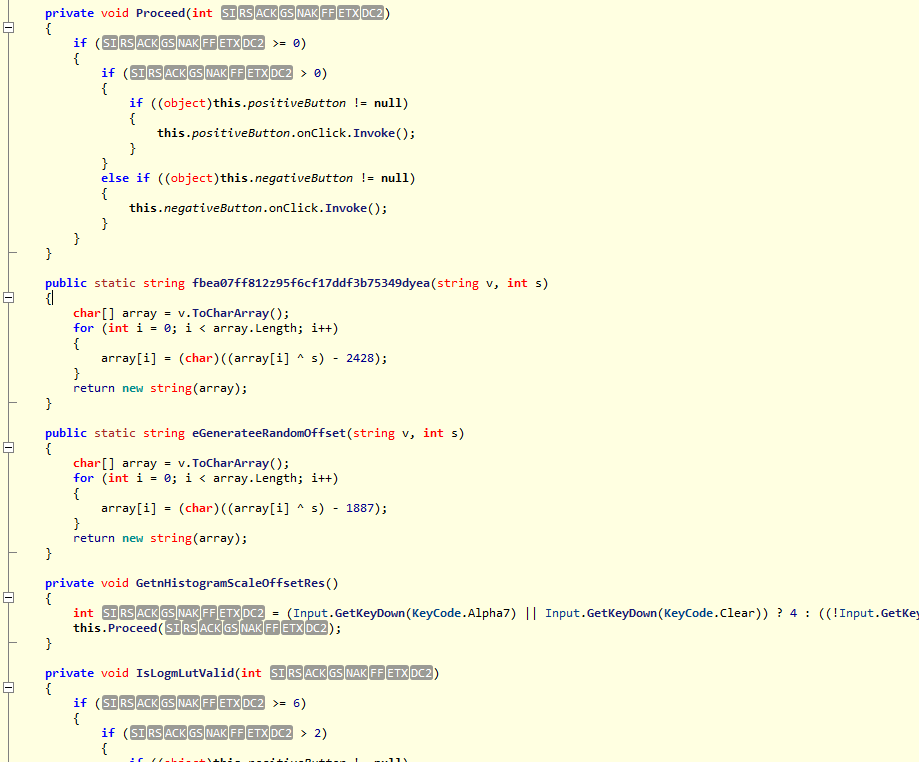
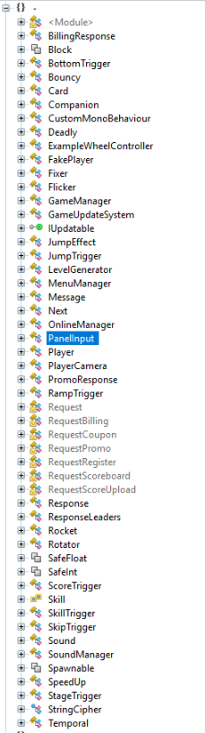
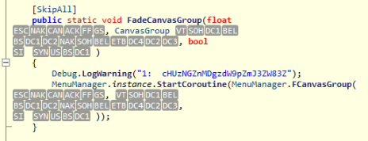

# Infinite Jumps II: Suspicious binaries: Write-up

Предыдущие части:

* [Win the flag](../infinitejumps/WRITEUP.md)

----

Прыгаем в `Assembly-CSharp.dll` (`infinite_jumps_Data/Managed`)
Видим частично обфусцированный код, но не пугаемся — зашифрованы лишь некоторые переменные и строки.



Видим дерево всех классов:



Постепенно доходим до класса `MenuManager` и замечаем строки вида

```
Debug.LogWarning("[1-6]: some strange data");
```



Последняя строка намекает на base64:

```
Debug.LogWarning("6:  k3NWY0MzBmODM3dmZ5Mzc1OWYyM3Y=");
```

Соединяем все части флага воедино и декодим.

Флаг: **ugra_flag2_unity3ng1n3_decompilation_1s_3asy**

----

Следующие части: 

* [Banned Hacker](../hackedjumps/WRITEUP.md)
* [Hidden Resistance](../upgradejumps/WRITEUP.md)

P.S. Понравилась игра?
Пиши сюда: pirotexnic27@yandex.ru
