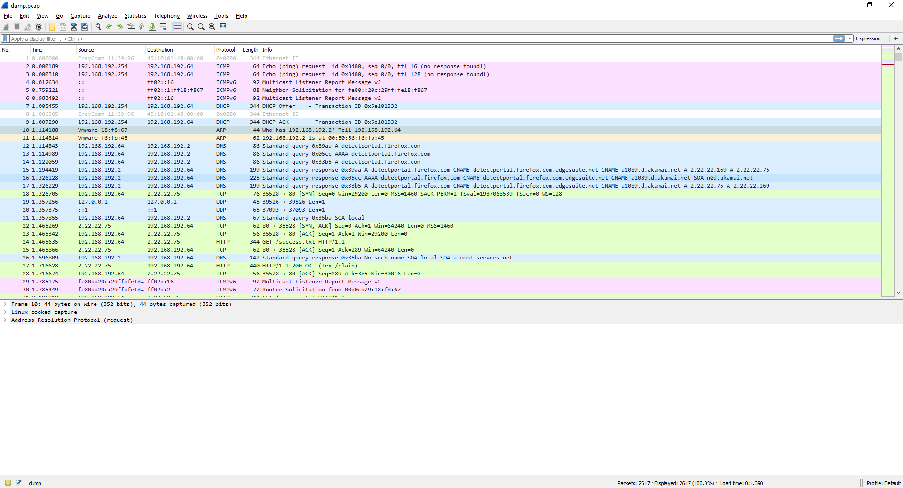
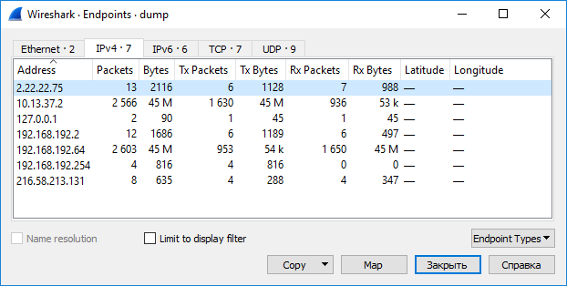

# International Malware: Write-up

Перед нами — .pcap-файл. Такие файлы содержат дампы сетевого трафика. Для их открытия может быть использована программа [Wireshark](https://www.wireshark.org/).



Зайдем на вкладку **Statistics** — **Endpoints**, чтобы посмотреть, что вообще передавалось. Видим 7 IPv4-адресов.



Видим IP-адрес `10.13.37.2`, который, по всей видимости, тут не просто так, и `192.168.192.64`, на который передано столько же трафика.

Делаем вывод, что с наибольшей вероятностью именно в этих 45 МБ находится флаг.

Действительно, если посмотреть пакеты, то `192.168.2.2` и `192.168.192.254` использовались для получения IP-адреса по DHCP, а `2.22.22.75` и `216.58.213.131` — служебные адреса Firefox. Они нас не интересуют.

Оставим только необходимые пакеты фильтром `ip.addr == 10.13.37.2`. Видим TCP и HTTP-трафик.

Из всего этого трафика можно выделить всего лишь 2 HTTP-запроса с клиента (`192.168.192.64`, с которого и снимался дамп) на сервер (`10.13.37.2`).

Первый запрос — главная страница:

```
GET / HTTP/1.1
Host: secretalliance.net
User-Agent: Mozilla/5.0 (X11; Linux x86_64; rv:52.0) Gecko/20100101 Firefox/52.0
Accept: text/html,application/xhtml+xml,application/xml;q=0.9,*/*;q=0.8
Accept-Language: en-US,en;q=0.5
Accept-Encoding: gzip, deflate
Connection: keep-alive
Upgrade-Insecure-Requests: 1
```

В ответ возвращается HTML-страница:

```
HTTP/1.0 200 OK
Server: SimpleHTTP/0.6 Python/3.5.2
Date: Mon, 04 Jun 2018 14:12:15 GMT
Content-type: text/html; charset=utf-8
Content-Length: 344

<!DOCTYPE HTML PUBLIC "-//W3C//DTD HTML 4.01//EN" "http://www.w3.org/TR/html4/strict.dtd">
<html>
<head>
<meta http-equiv="Content-Type" content="text/html; charset=utf-8">
<title>Directory listing for /</title>
</head>
<body>
<h1>Directory listing for /</h1>
<hr>
<ul>
<li><a href="malware.zip">malware.zip</a></li>
</ul>
<hr>
</body>
</html>
```

Как видим, в директории один файл — `malware.zip`. Угадайте, каким же будет следующий запрос? Удивительно, но клиент попробует скачать файл:

```
GET /malware.zip HTTP/1.1
Host: secretalliance.net
User-Agent: Mozilla/5.0 (X11; Linux x86_64; rv:52.0) Gecko/20100101 Firefox/52.0
Accept: text/html,application/xhtml+xml,application/xml;q=0.9,*/*;q=0.8
Accept-Language: en-US,en;q=0.5
Accept-Encoding: gzip, deflate
Referer: http://secretalliance.net/
Connection: keep-alive
Upgrade-Insecure-Requests: 1
```

Мы можем тоже попробовать зайти на secretalliance.net, но, увы, это не тот сайт — ведь IP 10.13.37.2 лежит в локальной сети.

Остается лишь одна опция — получить ответ, содержащий интересующий нас архив, из трафика прямо в Wireshark.

Это несложно: выбираем **File** — **Export objects** — **HTTP…**. В открывшемся меню остается лишь выбрать интересующий нас файл `malware.zip`. Сохраняем его.


В архиве два файла — видео `videoflag.mp4` и картинка `donotopen.png`. Видео содержит лекцию Андрея Гейна про протокол HTTP, а на картинке написан флаг.

Флаг: **ugra_it_was_easy.pcap**
