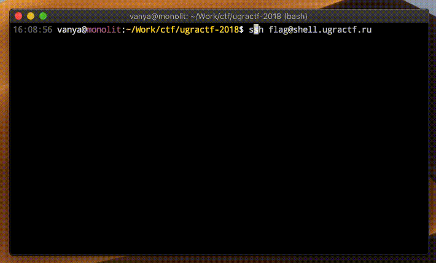

# Странный парень: Write-up

Заходим по SSH, попадаем… в [emacs](https://ru.wikipedia.org/wiki/Emacs) — текстовый редактор.

Вот все, наверное, уже умеют из вима выходить, а из емакса — вряд ли.

## Решение от Никиты

В emacs можно запустить кастомный процесс таким образом: `Alt` + `X` + `term`, затем вводим адрес бинарного файла: `/bin/bash`

Там делаем `ls`, видим картинку-флаг. Поднимем простой HTTP-сервер с помощью Python: `python3 -m http.server 23456`. Заходим на `shell.ugractf.ru:23456` и скачиваем флаг.

## Решение от Вани

Ваня использует `eshell`:

Также вместо HTTP-сервера он загружает файл по `scp` с нашего сервера на свой.

Флаг: **ugra_emacs_1_l0v3**
