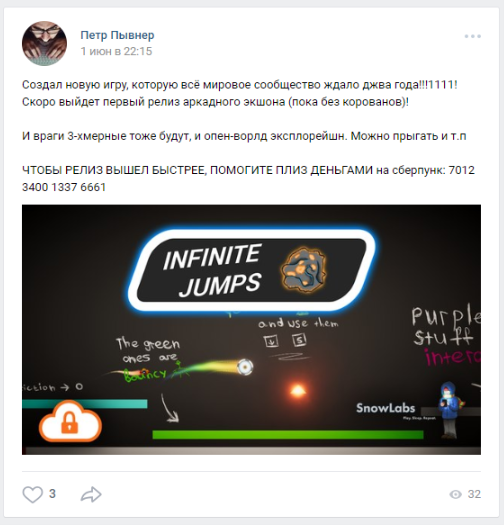
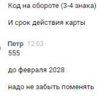

# Infinite Jumps IV: Hidden Resistance: Write-Up

Предыдущие части: 

* [Win the flag](../infinitejumps/WRITEUP.md)
* [Suspicious binaries](../jumpinside/WRITEUP.md)
* [Banned Hacker](../hackedjumps/WRITEUP.md)

----

В этом таске нам даже не придется лезть в исходники, поэтому забудем о них на время.

Короткое название таска (`upgradejumps`, было в URL), категория или просто решения остальных тасков могут намекнуть нам на то, что четвертый флаг скрывается за «неактивной» кнопкой Upgrades.

Жмем и попадаем в вирус, который вымогает деньги с нашей карточки. Замечаем, что платежный шлюз принимает только карты типа VIKA.

Но это же таск категории **recon**! Идем на страницу разработчика игры — Петра Пывнера. Мы уже знаем его с отбора, поэтому заходим сразу в ВК и в Твиттер. В ВК мы находим... пост с просьбой задонатить на карту той самой платежной системы!

Также выше опубликован пост следующего содержания:

> Сегодня опять мошенники из сберпанка звонили :(((((
> 
> Украли 40 тысяч с карты

Если просто ввести номер карты, имя владельца (`Peter Pwner`, как в твиттере), а остальные данные указать случайно, то получим ошибку «Некорректные данные».

Но информация о краже 40 тысяч рублей позволяет нам сделать вывод, что Петр не очень заботится о своих конфиденциальных данных и их можно украсть!

Пишем ему в личку что-то типа:

> Привет, Пётр! Я сотрудник Сберпунка. Мы увидели твой пост и 
> хотим разобраться в ситуации с кражей. Уже оформлена заявка
> на возврат, нам нужны лишь некоторые данные для подтверждения
> личности.

Пётр радостно отвечает и отдает нам срок действия и CVV-код карты.

Вводим их в игру и видим чат Hidden Resistance. В одном из спам-сообщений и лежал флаг.

Флаг: **ugra_flag4_v3ry_1mP0RTant_s3Cr3t_cHat**

----

P.S. Понравилась игра?
Пиши сюда: pirotexnic27@yandex.ru