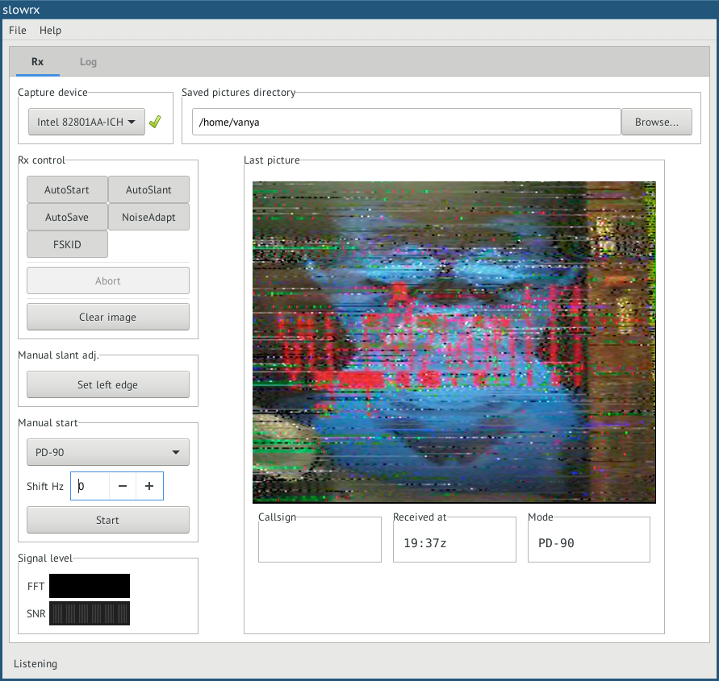

# Yakubovich: Write-up

Заходим на сайт и внимательно его изучаем. Натыкаемся на телефон *по вопросам флагов*, да ещё и оканчивающийся на *1337*. Набираем, слышим страшные звуки. На всякий случай записываем их.
  
Понимая, что это всё как-то связано с МКС. На сайте есть интересная картинка-ребус с прямым призывом к действию. Узнаём, что космическая станция периодически ведёт SSTV-трансляции. SSTV — это формат передачи изображений через аудиосигнал.  

Втыкаем запись в софт для декодирования, который должен определить режим передачи: PD-90 — как на МКС, но чуть короче. 

Казалось бы, при чём тут Якубович?

Флаг: **ugra_vy_p0zvon1l1**
